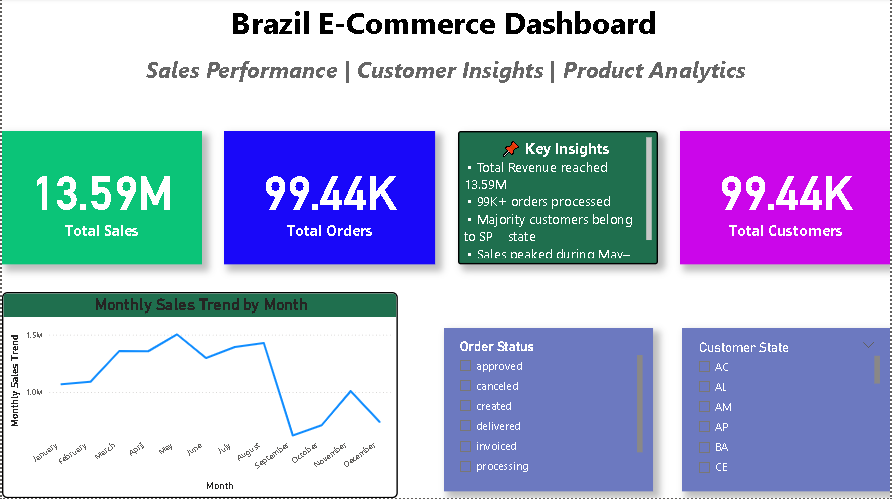
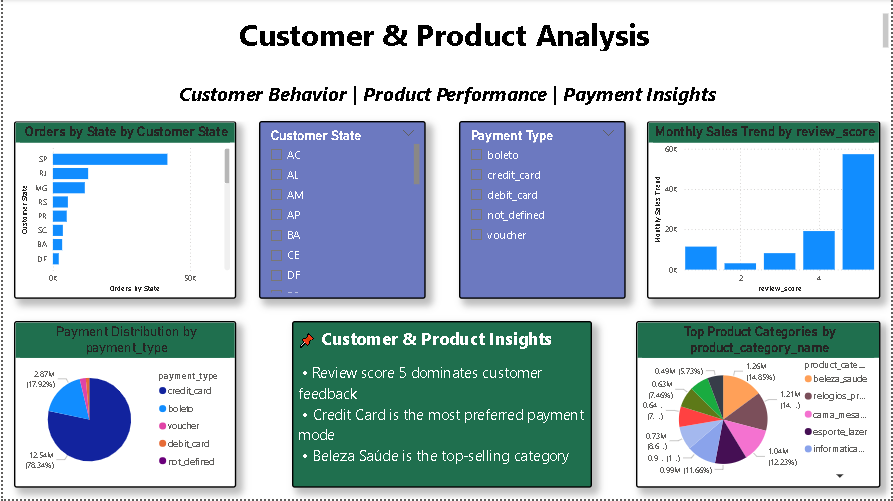
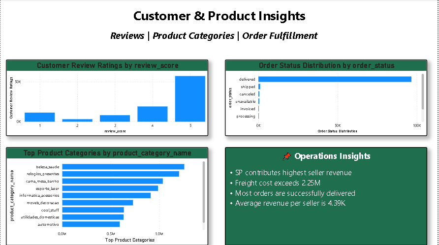
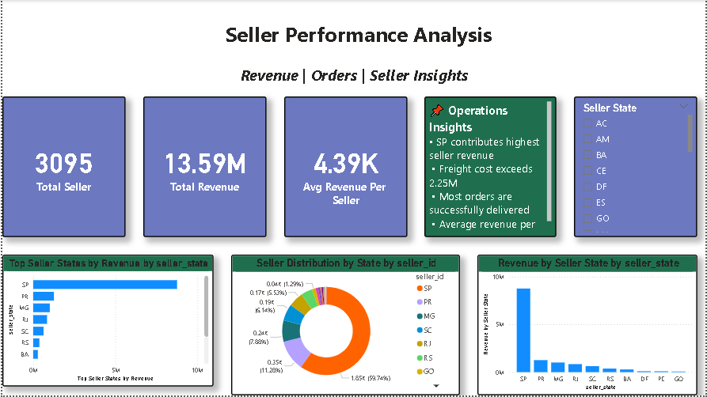
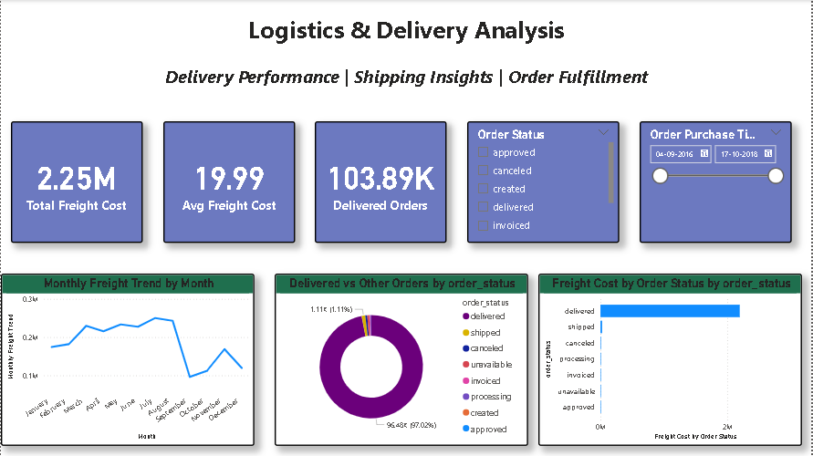

# Brazil E-Commerce Power BI Dashboard

## Project Overview

This Power BI Dashboard provides comprehensive insights into Brazil's E-Commerce sales, customer behavior, product performance, seller analysis, and logistics operations using the Olist E-Commerce Dataset.

## Tools Used

- Power BI
- Power Query
- DAX
- Excel

## Dashboard Pages

### 1. Sales Performance Dashboard
- Total Sales
- Total Orders
- Total Customers
- Monthly Sales Trend
- Order Status Analysis
- Customer State Analysis

### 2. Customer & Product Analysis
- Orders by State
- Customer Distribution
- Payment Distribution
- Product Category Analysis
- Review Score Analysis

### 3. Customer & Product Insights
- Customer Review Ratings
- Product Category Performance
- Order Status Distribution

### 4. Seller Performance Analysis
- Total Sellers
- Total Revenue
- Average Revenue per Seller
- Revenue by Seller State
- Seller Distribution Analysis

### 5. Logistics & Delivery Analysis
- Total Freight Cost
- Average Freight Cost
- Delivered Orders
- Freight Trend Analysis
- Delivery Status Analysis

## Dataset

Brazilian E-Commerce Public Dataset by Olist

## Key Insights

- Sales exceeded 13.59M.
- More than 99K orders were processed.
- Credit Card was the dominant payment method.
- São Paulo generated the highest number of orders.
- Most orders were successfully delivered.
- Seller revenue is highly concentrated in a few states.

## Dashboard Screenshots

### Sales Performance

### Customer & Product Analysis

### Customer & Product Insights

### Seller Performance Analysis

### Logistics & Delivery Analysis

## Author

Madhuri Kale
MBA (Business Analytics)
